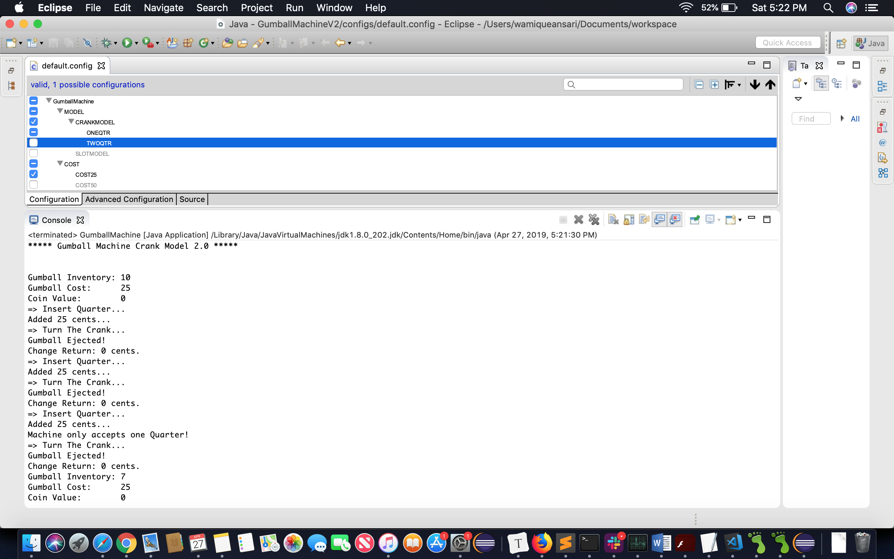
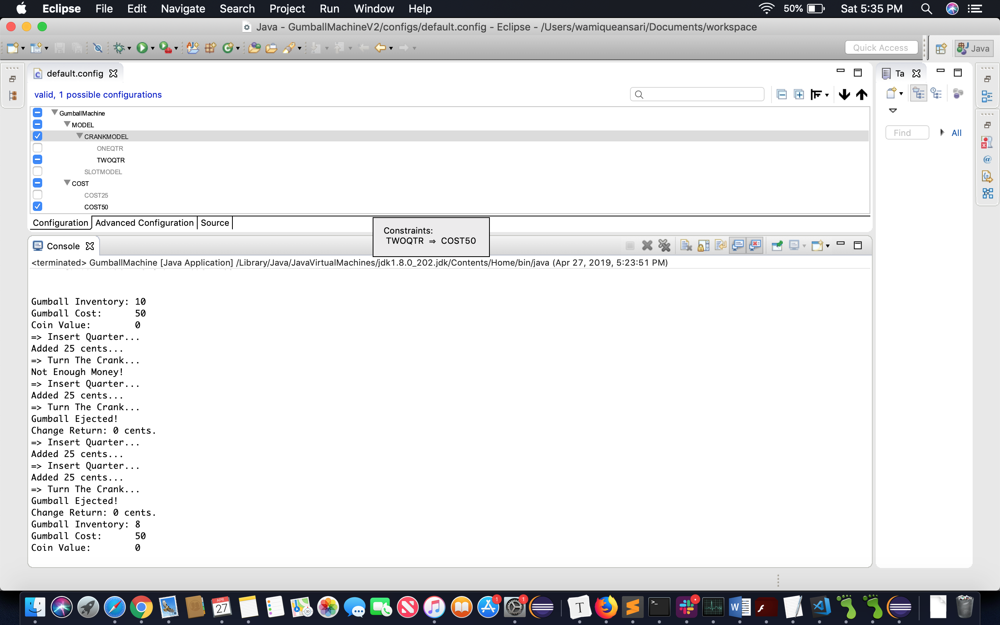
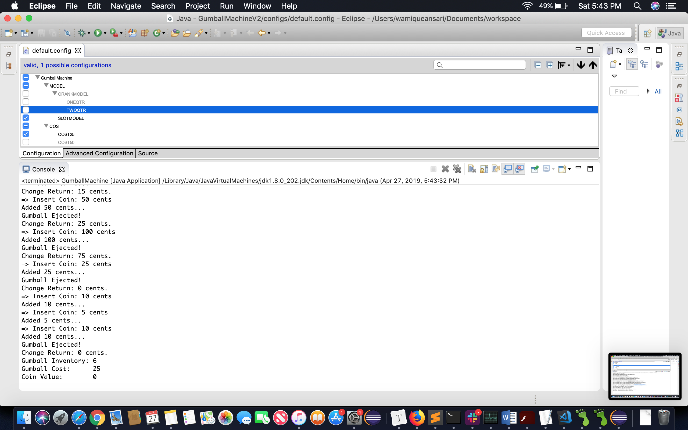
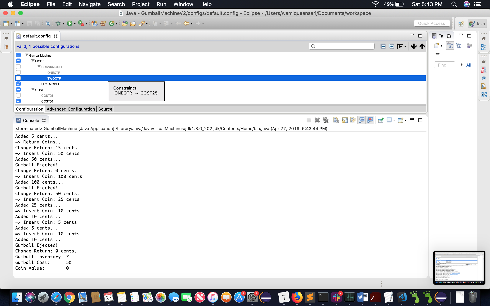

<h1>Comparison between Lab #10 and Lab #1:</h1>

<b>Crank Model (25 Cents)</b> 

 

<b>Crank Model (50 Cents)</b> 

 

<b>Slot Model (25 Cents)</b> 

 

<b>Slot Model (50 Cents)</b> 

 

<b>Lab1</b> 
In Lab 1, there were 3 Gumball Machines created using same configuration which was crank model. These gumball machines were created using object oriented programming. These gumball machines were expecting user input in order to get configured. Once user gives input, program will create Gumball machine with appropriate cost required to release a gumball and the gumballs this gumball machine has. Therefore, it makes it difficult to maintain the code if gumball needs to be configured with different configuration.
  
<b>Lab10</b> 
In Lab 10, there is 1 Gumball Machine created via Feature IDE project in Eclipse. This Gumball Machine is being configured based on different configuration files and aspectJ files. Whatever configuration is chosen, the Gumball Machine will follow the same configuration. Therefore, it is to maintain the code if we ever want to change  the configuration. In this program, there are two configurations: Crank model and Slot model. Moreover, this gumball machine doesn't need any input from user to get configured in terms of how much amount it requires to release a gumball.