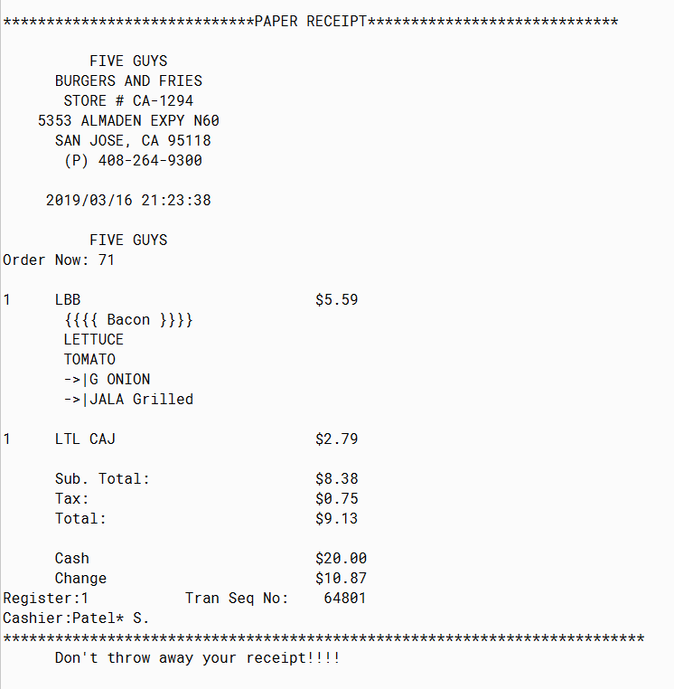
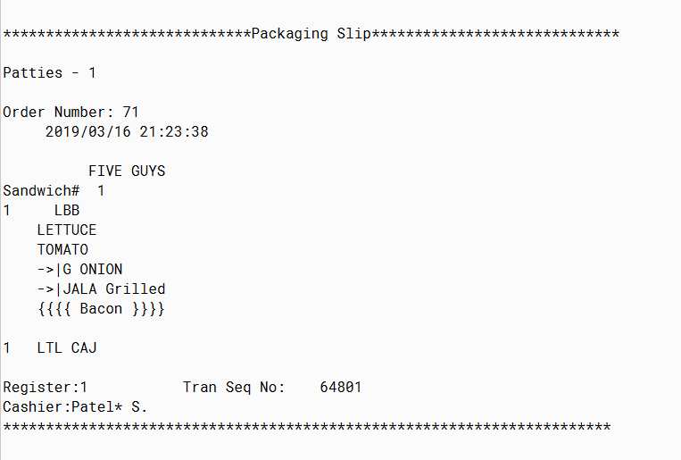

#alt-h2 Lab 6 Implementation:

I have created StrategyTest Class which contains the main method.

There is one class Order which holds the full order. There are 2 other classes for Burgers and SideItems (e.g. Fries, Milkshake). Burgers and SideItems are added in the Order.
The Order has a reference of DisplayStrategy.

There is an interface DisplayStrategy which declares methods to be implemented in Classes that implements DisplayStrategy interface.

The 2 classes which implement DisplayStrategy are PaperReceipt and Packaging Slip. Both of these classes print the order in different style.

The StrategyTest creates Order and adds Burger(s) and Sideitem(s) in the Order. Then, StrategyTest sets the strategy in the Order's DisplayStrategy reference. Based on what object DisplayStrategy's reference points to, the receipt will be printed.

The printed receipt can be PaperReceipt or PackagingSlip.

Following is an exaplme of output:

By default, the DisplayStrategy points to "PaperReceipt".

Now DisplayStrategy reference is pointing "PackagingSlip".

Now DisplayStrategy reference is pointing "PaperReceipt".

